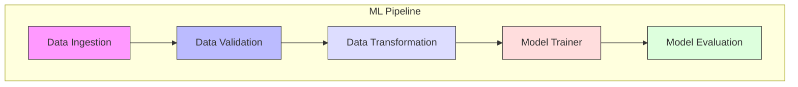
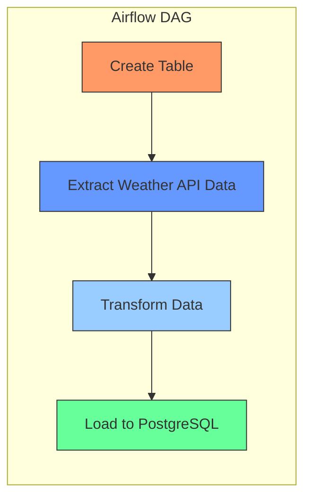

# 🚀End-to-End Data Science Project

This repository contains three main projects focusing on data engineering, ETL pipelines, and data analysis. The project demonstrates implementation of ML pipelines, ETL processes, and pandas-based data analysis.

### This repository contains three distinct data science components:

- End-to-End Flask ML Application
- ETL Pipeline with Airflow
- Data Analysis with Pandas

## 1. End-to-End Flask ML Application
A complete machine learning pipeline implemented with Flask, incorporating MLflow and DagsHub for experiment tracking.

### Workflows--> ML Pipeline

1. Data Ingestion
2. Data Validation
3. Data Transformation-- Feature Engineering,Data Preprocessing
4. Model Trainer
5. Model Evaluation- MLFLOW,Dagshub



## Implementation Steps

1. Configure settings in config.yaml
2. Define data schema in schema.yaml
3. Set model parameters in params.yaml
4. Update entity definitions
5. Modify configuration manager in src/config
6. Enhance pipeline components
7. Update the pipeline orchestration
8. Refine main.py implementation

## Project Structure

```
src/
├── datascience/
│   ├── components/
│   │   ├── data_ingestion.py
│   │   ├── data_transformation.py
│   │   ├── data_validation.py
│   │   ├── model_eval.py
│   │   └── model_trainer.py
│   ├── config/
│   ├── constants/
│   ├── entity/
│   ├── pipeline/
│   └── utils/`
```

## Flask-Model Screenshots


## Setup Instructions

  1) Clone the repository
  2) Install dependencies:

```
pip install -r requirements.txt
```

  3) Run the application:

```
python app.py
```

## 2. ETL Pipeline with Airflow
An automated ETL pipeline that fetches weather data from an API and stores it in PostgreSQL database.

## Workflow

## ETL Pipeline Screenshots
### DAG View in Airflow

### Pipeline Execution Log

### Result in Database in DBeaver


## Pipeline Components
Data Extraction: Weather API integration
Data Transformation: Processing weather information
Data Loading: PostgreSQL database storage

## Setup Instructions

  1) Install Astro CLI
  2) Ensure Docker Desktop is running
  3) Start the Airflow instance:
  ```
  astro dev start
  ```

  If timeout occurs:
  ```
  astro dev start --wait 15m
  ```

## 3. Data Analysis with Pandas
Jupyter notebook containing data analysis tasks using Pandas.

## Features

CSV data loading and manipulation
Statistical analysis
Data filtering and grouping
Categorical data analysis

## Setup Instructions

Open PythonAssignment.ipynb in Jupyter Notebook/Lab
Select appropriate kernel
Run cells sequentially

## Future Work

1. Flask ML Application

- Add real-time prediction capabilities
- Implement A/B testing framework
- Enhanced model monitoring


2. ETL Pipeline

- Add more data sources
- Implement data quality checks
- Add alerting system


3. Data Analysis

- Automated reporting
- Interactive visualizations
- Advanced statistical analysis


## License
This project is licensed under the GNU General Public License v3.0 - see the LICENSE file for details.

## Contact Information
For questions or collaboration opportunities:

[](mailto:rahulsamantcoc2@gmail.com)  [](https://github.com/rahulsamant37/)  [](https://www.linkedin.com/in/rahul-samant-kb37/)
